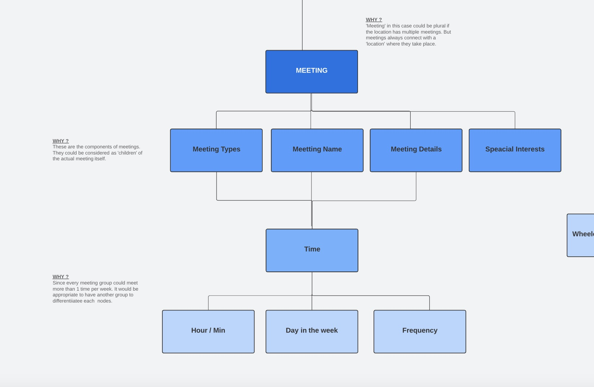

# Assignment Week 4

This week assignment is to explore the 'hierarchy' of data structure, the goal is to decode the key elements of the data set we're dealing with. In this case, we are using AA meetings as the data sets and the end product would be a tool or visualization that would help users(AA members or anyone who's interested in joining AA meetings) navigate & get to the correct meeting that matches their needs.   

## Framework
1. Do more research on AA meetings : Since I have very little knowledge about the AA meetings, it's obvious to me that I need to look around and gather more insights on the end user's experience. Few resources I came across are [Reddit/ AA group ](https://www.reddit.com/r/alcoholicsanonymous/), [AA Org](https://www.aa.org) and [NY Inter Group](https://www.nyintergroup.org/meetings/?tsml-day=any&tsml-type=REOP&subid=holy-trinity-church-fellowship-hall). These resources helped me understand from users' point of view and provider's point of view. 
2. Create a flowchart map : This map is not necessary a formal version of 'hierarchy' but it helps me see a big picture of what I should compose my data and see every element in a detailed perspective. 

The big picture: 

The components : 

- Meetings : 
'Meeting',in this case, could be plural if the location has multiple meetings. But  meetings always connect with a 'location' where they take place.  The time pieces should also be linked here since every meeting group could meet more than 1 time per week. It would be appropriate to have another group differentiating each nodes.  

- Addresses : Each location has only one address, It would be more appropriate to put 'Address' in the same level as 'Location or Building name'. The information about each addresses is very static, meaning that it is not as complex as meeting's details and the way we can store data is very simple. 

3. Tabs on Excel : In the excel file, I created 4 Tabs which are the followings ... 

- Details About Meetings : I want to divide into 2 tables because there are some level of uncertainties in the nature of this data set. Since the meetings could be arranged in any building and each one is also highly detailed. It seems more logical to separate and link the data by the name of the building. 

- Details About Addresses : Using the same idea as above, the linkage between meetings and addresses is 'Building Name'. Thus, in this tab, it's only have 3 rows that only has the building related information. Separating the addresses in another table would also decrease the chance of data formatting errors because this information would not be edited frequently. 

- Components : this tab consists of many tables that are basically technically 'arrays' They can be treated as isolated components so wee can pull data easily from these isolated components. 

- Research : this tab has multiple resources of what should be considered when we design the website later on, it's important to keep in mind on what the frequently asked questions are for this specific type of directory. 

