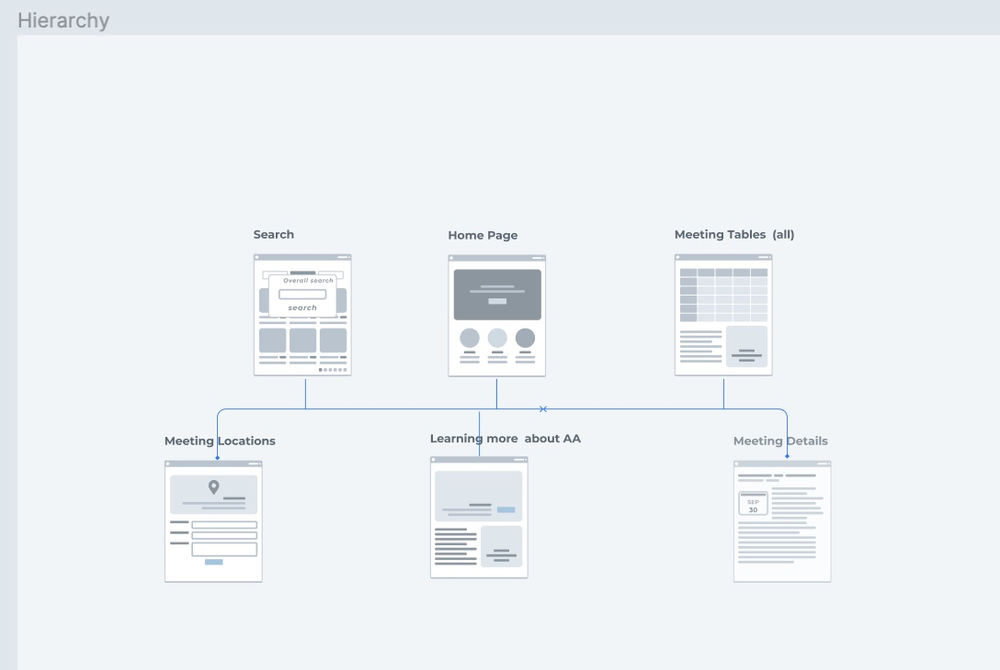
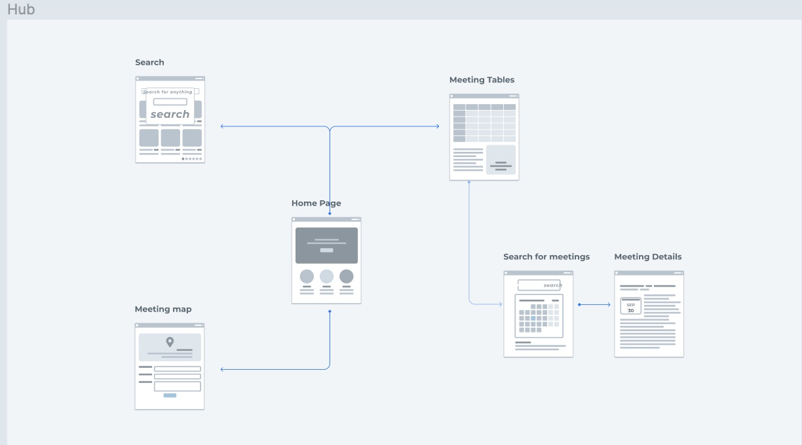
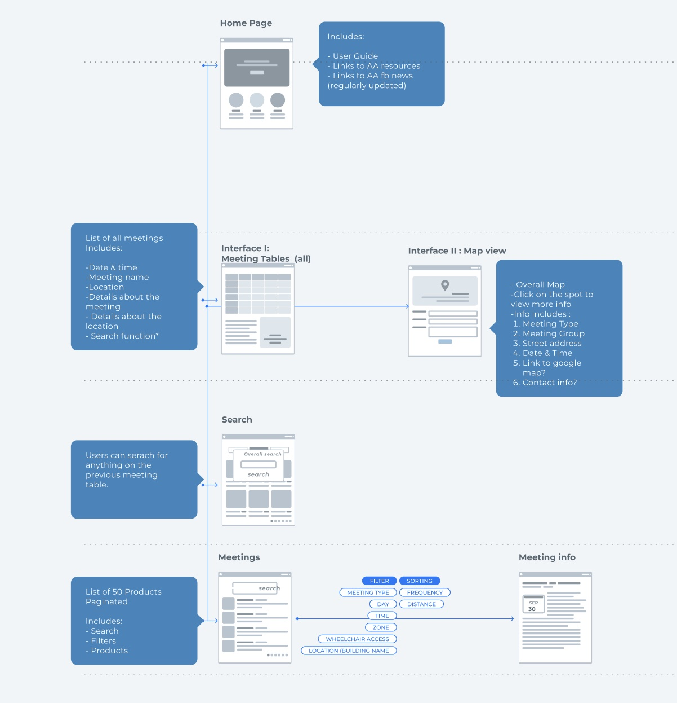
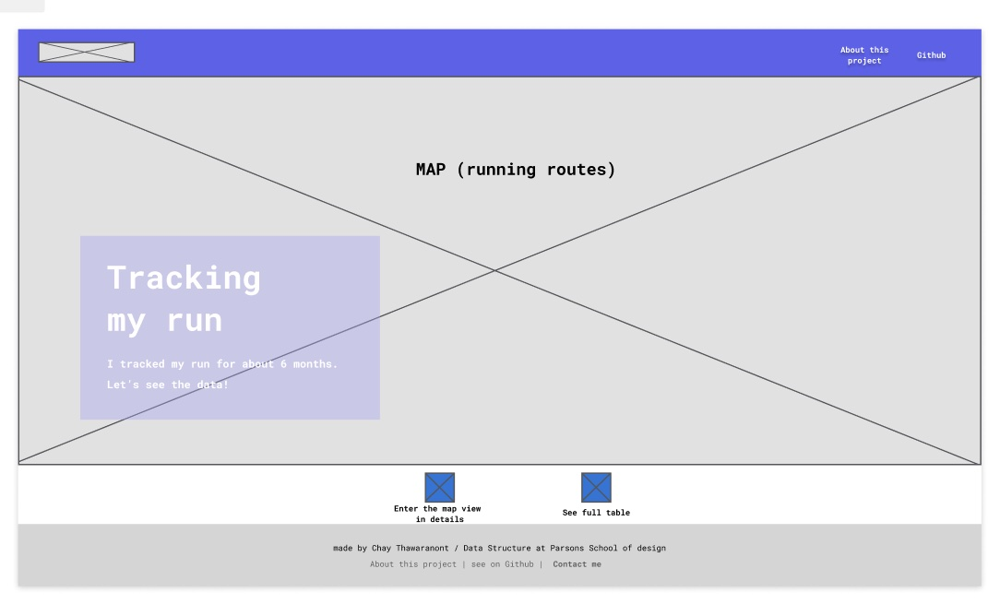
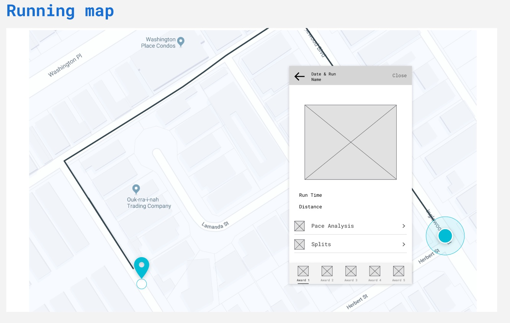

# Week 10 assignment

This week, I have designed initial wireframes for 3 of my final projects. 

## Project I : AA meetings 

## Project II : Process Blog

## Project III : Sensoring temperature 

## Contributing
- Chay Thawaranont, design 
- Aaron Hill, advisor

## related links
[ meetings ]( https://github.com/Chayanitoey/Data-Structures/tree/main/week%207)
