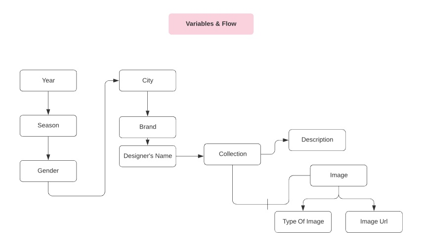
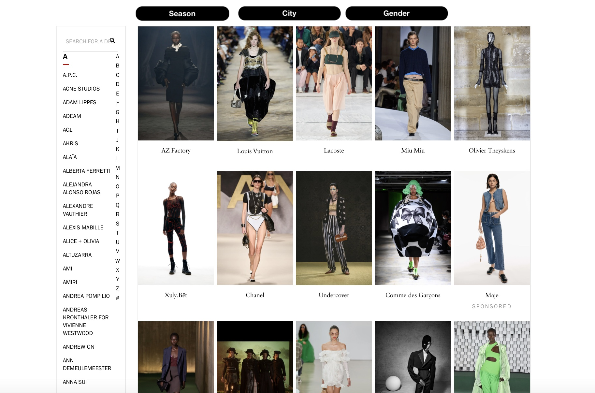
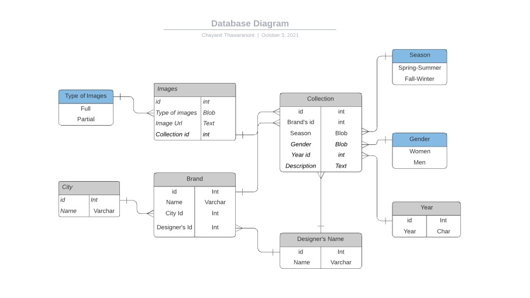

# Assignment Week 5.1

Since the assignment this week is to create a ‘process blog’, I decided to use the accessible data set and the data set I am most comfortable working with, ‘Runway emReady-To-Wear Collections’.

## Prologue

If you are in the fashion world, you’re probably familiar with the idea of how the fashion brands work. Usually the fashion brands produce their collections in advance so that the retailers around the world could make orders and choose which fashion looks they want to ‘buy’ for their stores.
These runway shows are invitation-only shows for those global ‘wholesale buyers’ but most brands make their shows accessible to the retail buyers ( like us) in the digital formats ( imageries or videos)
That’s said, to produce the well-structured directory of these shows, I would consider these 2 types of user: Wholesale and retail buyers.

## Variables

In the fashion world, everyone updates their designs seasonally- and usually there are 2 main seasons that are more influential than others, which are ‘Fall-Winter’ and ‘Spring-Summer’. Each brand would produce their clothing or accessories collection seasonally and each brand could have clothing for Men and Women and they could also have images that showing full-look or close-up look so viewers can see the product in detail. As the data gets complex, I’d rather use this chart to explain :

The screenshot above shows the data hierarchy and the connection between each variables.

The variables are ...

-Year
-Season
-Gender
-City
-Brand
-Designer's Name
-Collection
-Description
-Image
-Type of image
-Image Url

To keep things in line and eliminate redundancy, I would say ‘Normalized data’ is the best practice to prepare our database in this case.

The outcome could possibly look like this :

Edited Reference from : [vogue] (https://www.vogue.com/fashion-shows)

Users will have the full ability to search on anything since this is built in Nosql database.

